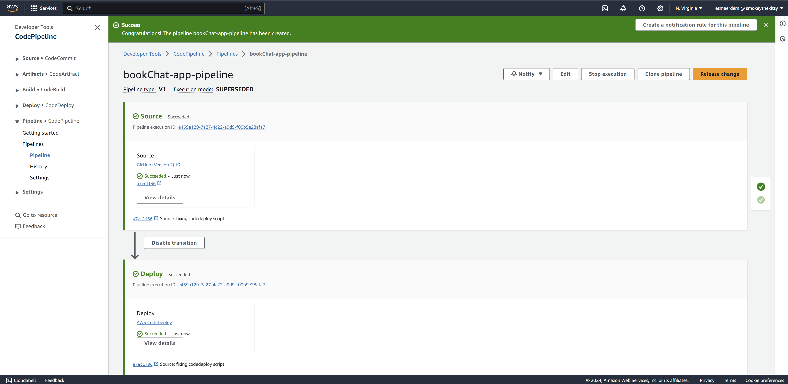

# Book Chat App

[LIVE](https://bookchat.surge.sh/)


## Introduction

Welcome to the documentation of the Book Chat App. This project consists of a Node.js, Express, and PostgreSQL-based RESTful API for the backend and a React-based frontend. The application serves as a feature-rich book discussion platform, allowing users to explore, discuss, and engage with library of books from Google Book API and to LIVE CHAT with other users using WebSockets.


## Key Features

- **External API Integration:** Seamlessly incorporate book data from the Google Book API using Axios, providing users access to an extensive library of books for exploration.

- **Relational Database and Validation:** Design and implement a resilient PostgreSQL database schema coupled with JSON Schema validation. This ensures a smooth process of storing and retrieving data, enhancing overall database integrity and safeguarding against malformed data.

- **User Authentication and Authorization:** Strengthen security measures with user registration, login functionalities, and JWT token-based authentication. Frontend validation is facilitated by Formik, guiding users through secure login and signup processes while maintaining data integrity.

- **Live Chat:** Connects users to live chat privately usingn WebSockets. Users can also view all of their open chat room in chronogical order and continue conversation

- **Browsing and Filtering Books:** Empower users to effortlessly browse and filter books, explore detailed information, like books, add reviews, and engage with liked reviews. Employ debouncing in the frontend to enhance user experience by preventing unnecessary API calls with filtering. In the backend, efficiently retrieve filtered data from the Google Books API through external API AJAX calls.

- **Browsing and Filtering Book Reviews:** Enable users to navigate through book reviews, applying various filters such as likes and adding their own reviews. Employ debouncing in the frontend for streamlined user interactions with filtering. On the backend, leverage SQL queries to efficiently fetch filtered review data from the database.

- **User Follow System:** Foster social interaction by implementing a user-follow system, allowing users to connect with each other. The frontend dynamically updates to enhance user experience, creating an engaging social environment.

- **App Flow:** Implement infinite scrolling in the frontend to provide users with a seamless data browsing experience. This feature allows users to explore a vast library of books effortlessly, enhancing the overall app flow. The UI, partially created with Material UI, contributes to an aesthetically pleasing and user-friendly interface.

- **Modularization and Code Reusability:** Prioritize code reusability, maintainability, and flexibility by utilizing object classes. In the frontend, emphasize component reusability and implement common hooks for efficient code organization and scalability.

- **Testing and Error Handling:** Ensure a bug-free user experience through thorough testing of each route and model method. Implement robust error handling mechanisms, covering both frontend and backend components. Conduct unit tests and integration tests that simulate various user actions and include edge cases. Test data-dependent components using mocked values to validate the application's resilience under different scenarios.

```Javascript
test("Submitting the form calls login function", async () => {
   ...
   fireEvent.change(usernameInput, { target: { value: "username" } });
   fireEvent.click(submitButton);
  
   await waitFor(() => {
        expect(mockLogin).toHaveBeenCalledWith({
          username: "username",
          ...
        })
      ...
   })
})
```

```Javascript    
   test("should fail without correct review id", async function () {
      const resp = await request(app)
      .delete(`/reviews/nope/books/nope/users/u1`)
      .set("authorization", `User Token ${u1Token}`);
      expect(resp.statusCode).toEqual(404);
   });        
```

-**CI/CD Pipeline:** Implemented a CI/CD pipeline using AWS services. In this pipeline, Amazon EC2 is utilized to build servers, while S3 provides data storage. CodeDeploy automates application deployments to EC2 instances, and CodePipeline orchestrates the build, test, and deploy phases of the release process.



## Tech Stack

- Node.js/Express: The backend server is built using Node.js and the Express framework.

- PostgreSQL: PostgreSQL is used as a relational database to store and manage data efficiently.

- React: The frontend is built using the React library for building user interfaces.


## Getting Started

1. Clone the Project: Navigate to the directory where you want to clone the project and run:

```
git clone https://github.com/EsmaNErdem/BookChat-Backend.git
```

2. Install Backend Dependencies: Install the project dependencies using npm:

```
npm install
```

3. Creating book_club database and test database while seeding initial data:

```
psql
\i book_club.sql
```

4. Start the server by running:

```
node server.js
```

5. Create your a GoogleAPI key and put it in .env:

```
API_KEY= your key
```
    
6. Run Backend Tests: To run the tests and ensure everything is working correctly, use Jest:

```
jest -i
```

6. Connecting frontend:
```
git clone https://github.com/EsmaNErdem/BookChat-Frontend.git
```

7. Install Frontend Dependencies: Install the project dependencies using npm:

```
npm install
```

8. Run Frontend Tests: To run the tests and ensure everything is working correctly:

```
npm test
```


## Database Schema


### Entities

- **Users:** Registered users with a unique username, including additional details such as first name, last name, email, and profile image.

- **Books:** Information about available books, including title, author, publisher, description, category, and cover image.

- **BookLikes:** Tracks user likes for specific books, establishing preferences.

- **Reviews:** User-generated reviews for books, capturing review text, reviewer's username, book ID, and timestamp.

- **ReviewLikes:** Records user likes for individual reviews, creating connections between users and their liked reviews.

- **Followers:** Represents follower-followee relationships between users, indicating who is being followed by whom.

- **Rooms:** Represents chat room with a given room name, and timestamp.

- **RoomMembers:** Represents users in given chat room id.

- **Messages:** Tracks text messages with sender name, chat room id and text message, and timestamp

### Relationships

- **BookLikes:** Establishes a many-to-many relationship between users and books, indicating users' liked books.

- **Reviews:** Connects users, books, and reviews, linking each review to a specific user and book.

- **ReviewLikes:** Forms a many-to-many relationship between users and reviews, showing which users liked which reviews.

- **Followers:** Captures the follower-followee relationship between users, indicating who follows whom.

- **RoomMembers:** Establishes a many-to-many relationship between users and chat rooms so a user can have many rooms while a room can hold several users.

- **Messages:** Build a relationship between users table and room id 


### Database Query
- SQL queries are parameterized to avoid injection attacks, ensuring the security of database interactions.
- Incoming data undergoes JSON Schema validation to ensure its conformity with the expected structure before being stored in the database, enhancing data integrity and preventing issues related to malformed data.
- Review Filtering is implemented efficiently with SQL to optimize the retrieval of reviews based on various criteria. The code allows users to filter reviews by book title, author, category, and username of the review owner. It also supports sorting options such as date of review post (default), number of review likes, and username in alphabetical order. The use of SQL joins and groupings efficiently fetches the required data in a single query, minimizing database load and improving performance.
- Interfered data from the database with data coming from an external API to enrich book information and user interaction.

## Further Study and Future Enhancements

The Book Chat App has a strong foundation, but there's always room for improvement and new features. Consider exploring the following ideas to enhance the app and provide an even better experience for users:

1. **User-Created Bookshelves:**
   Allow users to create personalized bookshelves to curate and organize their favorite books. Implement features such as adding, removing, and categorizing books within these user-defined bookshelves.

2. ~~**Chat System for Users:**
   Introduce a real-time chat system that enables users to communicate with each other. This feature can enhance the sense of community within the app, fostering discussions, recommendations, and social interactions among book enthusiasts.~~

3. **User Profile Image Upload:**
   Enhance user profiles by enabling image uploads. Allow users to personalize their profiles by uploading custom profile images, adding a visual touch to their presence on the platform.

4. **Book Recommendation System:**
   Implement a recommendation system by incorporating machine learning models. Analyze user preferences, reading history, and likes to provide personalized book recommendations. This can significantly improve the user experience and engagement.

6. **Notifications and Activity Feed:**
   Keep users informed about relevant activities by implementing a notification system and an activity feed. Notify users about new followers, likes on their reviews, or updates within their bookshelves.
