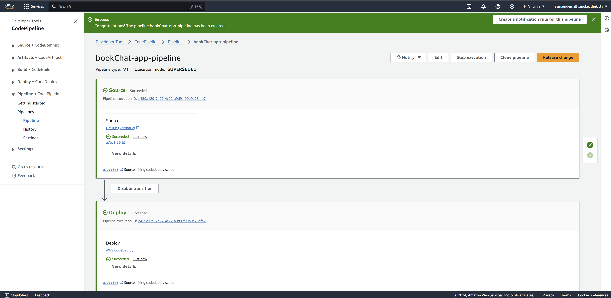
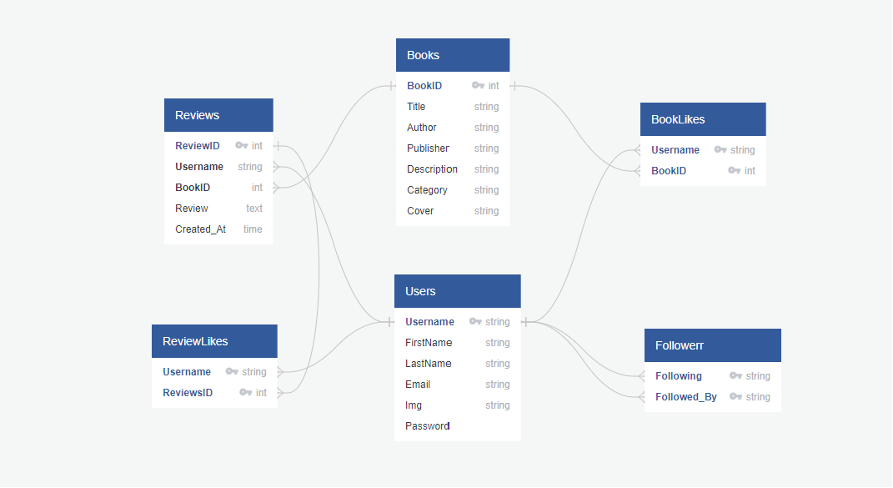

# Book Chat App - Backend

## Introduction

Welcome to the backend documentation of the Book Chat App. This Node, Express, and PostgreSQL-based RESTful API serves as the foundation for a feature-rich book discussion platform. Below, you'll find detailed information about the architecture, features, and technologies used in the development of this backend.

## Key Features

- **External API Integration:** Utilizing Axios to load book data from the Google Book API, enabling users to search and explore a vast library of books.

```Javascript 
class BookApi {
    static async request(endpoint, data = {}) {
        console.debug("API Call:", endpoint, data);

        const url = `${BASE_URL}/${endpoint}`;
        const params = {...data, key:API_KEY}
        
        try {
            return await axios.get(url, { params });
        } catch (err) {
          console.error("API Error:", err.response);
          let message = err.response
          throw new ApiNotFoundError(Array.isArray(message) ? message : [message]);
        }
    }
}
```

- **Relational Database and Validation:** Designing a robust PostgreSQL database schema with JSON Schema validation for seamless data storage and retrieval.

```Javascript 
router.post("/add/users/:username", ensureCorrectUser, async function (req, res, next) {
    try {
      const validator = jsonschema.validate(req.body, reviewNewSchema);
      if (!validator.valid) {
        const errs = validator.errors.map(e => e.stack);
        throw new BadRequestError(errs);
      }

      const review = await Review.add(req.params.username, req.body.book, req.body.review);
      return res.status(201).json({ review });
    } catch (err) {
      return next(err);
    }
});

```

- **User Authentication and Authorization:** Implementing user registration, login, and JWT token-based authentication to secure routes and protect user data.

```Javascript
function authenticateJWT(req, res, next) {
  try {
    const authHeader = req.headers && req.headers.authorization;
    if (authHeader) {
      const token = authHeader.replace(/^[Uu]ser [Tt]oken /, "").trim();
      res.locals.user = jwt.verify(token, SECRET_KEY);
    }
    return next();
  } catch (err) {
    return next();
  }
}
```

- **Browsing and Filtering Books:** Allowing users to browse and filter books, view detailed information,like books, add reviews, and like reviews for user engagement.

- **Browsing and Filtering Book Reviews:** Enabling users to browse book reviews, filter by various criteria, like reviews, and add their own book reviews.
[Link to /models/review.js](/backend/models/review.js)
```Javascript
    
    static async findAll(searchFilters = {}, page = 1, pageSize = 10) {
        ...

        let order = " ORDER BY r.created_at DESC"
        if (sortBy == "user") {
            order =  " ORDER BY r.username"
        } else if (sortBy == "popular") {
            order = ` ORDER BY "reviewLikeCount" DESC`
        } 

        query += whereExpressions.length > 0 ? ` WHERE ${whereExpressions.join(" AND ")}` : "";
        query += " GROUP BY r.id, b.id, u.img" + order;
        query += ` LIMIT $${queryValues.length + 1} OFFSET $${queryValues.length + 2}`;
        
        ...
    }
```

- **User Follow System:** Implementing a user-follow system to enhance social interaction, allowing users to follow each other and view their followers and following lists.

- **Modularization and Code Reusability:** Using object-oriented programming to enhance code reusability, maintainability, and flexibility in adding new features.

- **Testing and Error Handling:** Thoroughly testing each route and model method to ensure a bug-free user experience, and implement robust error handling mechanisms.

-**CI/CD Pipeline:** Implemented a CI/CD pipeline using AWS services. The CI/CD pipeline automates the process of building, testing, and deploying applications, streamlining development workflows and ensuring the rapid and reliable delivery of software updates. In this pipeline, Amazon EC2 is utilized to build servers, while S3 provides data storage. CodeDeploy automates application deployments to EC2 instances, and CodePipeline orchestrates the build, test, and deploy phases of the release process.

- **Technologies Used:**

- **Amazon EC2**: Amazon Elastic Compute Cloud (EC2) is utilized to provision virtual servers for building and deploying the application. EC2 instances provide scalable computing capacity and enable the creation of custom environments tailored to the project's requirements.

- **Amazon S3**: Amazon Simple Storage Service (S3) is employed as a durable and scalable object storage solution for storing application artifacts, build artifacts, and other data used in the CI/CD pipeline. S3 buckets serve as repositories for the artifacts produced during the build process.

- **AWS CodeDeploy**: AWS CodeDeploy automates the deployment of application code to Amazon EC2 instances. By defining deployment configurations and specifying deployment targets, CodeDeploy simplifies the process of rolling out updates to production environments, ensuring consistency and minimizing downtime.

- **AWS CodePipeline**: AWS CodePipeline orchestrates the entire CI/CD workflow, automating the build, test, and deployment phases of the release process. CodePipeline facilitates continuous delivery by connecting source code repositories, build servers, testing frameworks, and deployment services into a seamless and automated pipeline.



## Tech Stack

* Node.js/Express: The backend server is built using Node.js and the Express framework.

* PostgreSQL: PostgreSQL is used as relational database to store and manage data efficiently.

# To installing depencies 

1. Clone the Project: Navigate to the directory where you want to clone the project and run:

```
git clone https://github.com/EsmaNErdem/BookChat-Backend.git
```

2. Install Dependencies: Install the project dependencies using npm:

```
npm install
```

3. Creating book_club database and test database while seeding initial data:

```
psql
\i book_club.sql
```

4. Run the Application: Start the server by running:

```
node server.js
```

5. Create your a GoogleAPI key and put it in .env:

```
API_KEY= your key
```
    
6. Run Backend Tests: To run the tests and ensure everything is working correctly, use Jest:

```
jest -i
```

## Database Schema



**Entities:**

- **Users:** Represents registered users of the Book Chat App. Each user has a unique username, and additional details such as first name, last name, email, and profile image.

- **Books:** Stores information about books available on the platform. Includes details like title, author, publisher, description, category, and cover image.

- **BookLikes:** Tracks user likes for specific books. Connects users and books based on their preferences.

- **Reviews:** Contains user-generated reviews for books. Captures the review text, username of the reviewer, book ID, and the timestamp of creation.

- **ReviewLikes:** Records user likes for individual reviews. Establishes a connection between users and their liked reviews.

- **Followers:** Represents the follower-followee relationship between users. Each record shows who is being followed by whom.

- **Rooms:** Represents chat room with a given room name, and timestamp.

- **RoomMembers:** Represents users in given chat room id.

- **Messages:** Tracks text messages with sender name, chat room id and text message, and timestamp.

**Relationships:**

- The **BookLikes** table establishes a many-to-many relationship between users and books, indicating which users like which books.

- The **Reviews** table connects users, books, and reviews, linking each review to a specific user and book.

- The **ReviewLikes** table forms a many-to-many relationship between users and reviews, showing which users liked which reviews.

- The **Followers** table captures the follower-followee relationship between users, indicating who follows whom.

- **RoomMembers:** Establishes a many-to-many relationship between users and chat rooms so a user can have many rooms while a room can hold several users.

- **Messages:** Build a relationship between users table and room id .

### Database Query
- SQL queries are parameterized to avoid injection attack. 
SQL queries are parameterized to avoid injection attacks, ensuring the security of database interactions.
- Incoming data undergoes JSON Schema validation to ensure its conformity with the expected structure before being stored in the database, enhancing data integrity and preventing issues related to malformed data.
- Review Filtering is implemented efficiently with SQL to optimize the retrieval of reviews based on various criteria. The code allows users to filter reviews by book title, author, category, and username of the review owner. It also supports sorting options such as date of review post (default), number of review likes, and username in alphabetical order. The use of SQL joins and groupings efficiently fetches the required data in a single query, minimizing database load and improving performance.
- Interfered data from the database with data coming from an external API to enrich book information and user interaction.